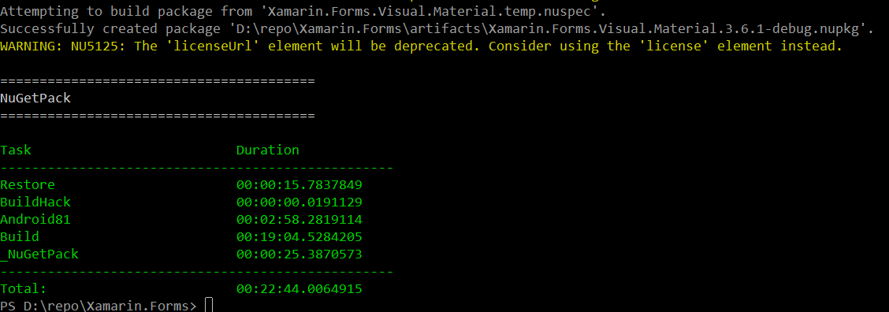
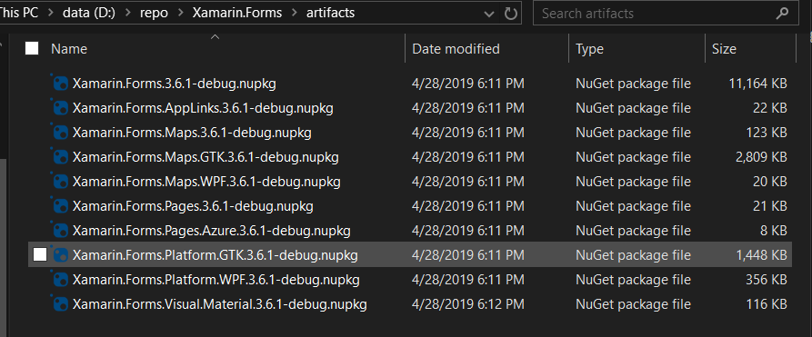
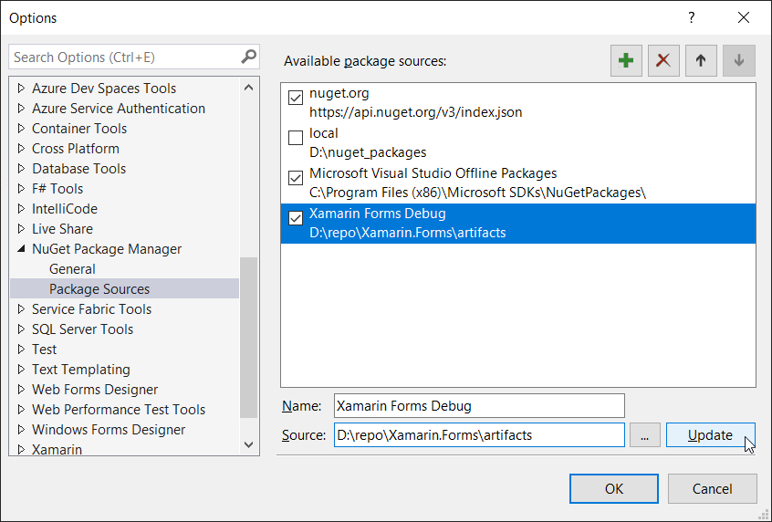
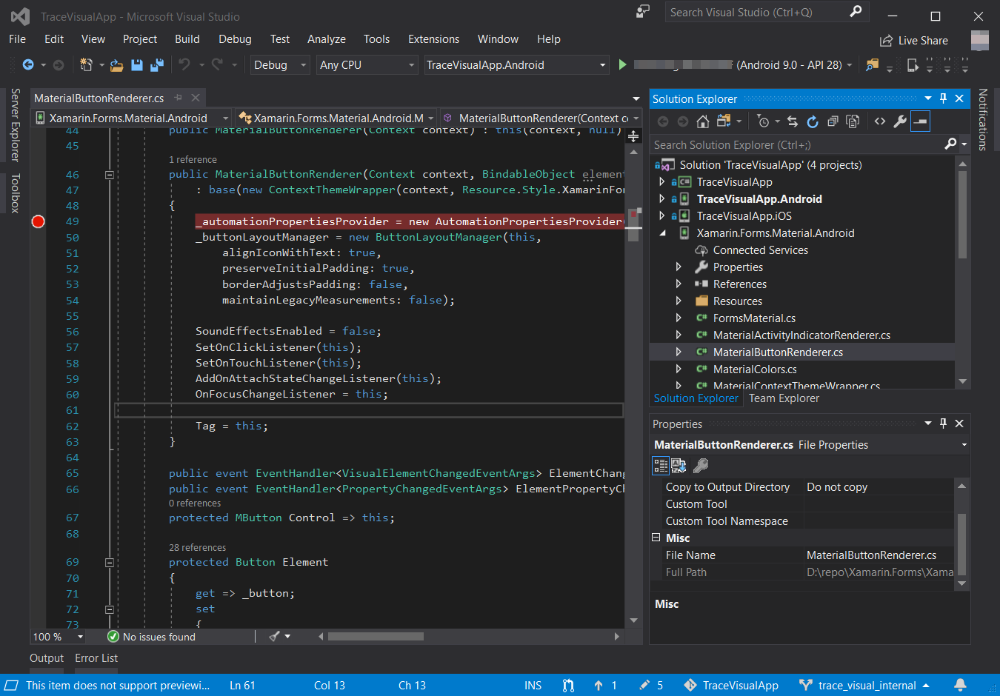

# Xamarin Forms Material Visual Example

## Decription

This is a simple Xamarin Forms using Material Design Visual demo:


## To run this example with debuggable Xamarin Forms nuget

0.  Besure to install Visual Studio 2017 with Xamarin workload, and Android SDK Platform 24 (Android 7.0).

1. Clone Xamarin.Forms github 3.6 branch source: <https://github.com/xamarin/Xamarin.Forms/tree/3.6.0> right align as this git repo:

----- [This git repo]  
     |  
 ---- [Xamarin.Forms v3.6 branch source]  

2.  Using PowerShell command to build debuggable Xamarin.Forms nuget:   
   ```
   .\build.ps1 -Configuration Debug -Target NugetPack -ScriptArgs '-packageVersion="3.6.1-custom"'
   ```

After it finish, should display like this:


3.  After successfull build, their will be an *artifacts* folder:  



4.  Add that folder as local nuget source:



5.  Open solution in Visual Studio, and you can add debug point in **Xamarin.Forms.Material.Android** project in MaterialButtonRenderer.cs file, happy debugging!

